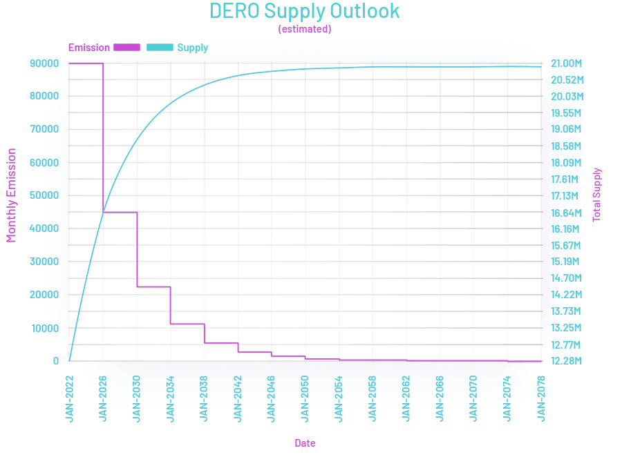
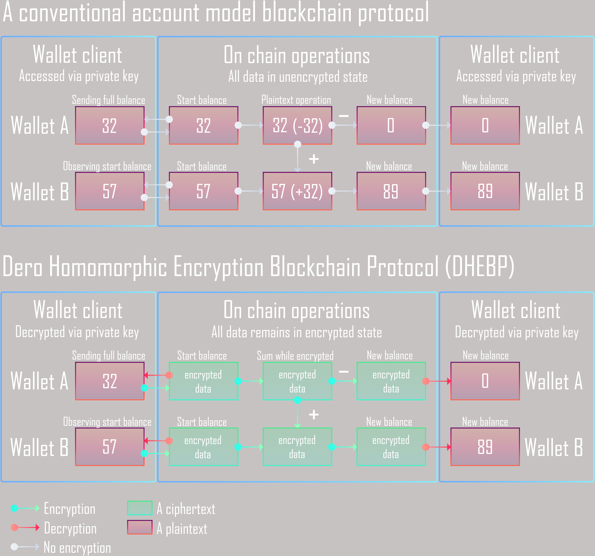
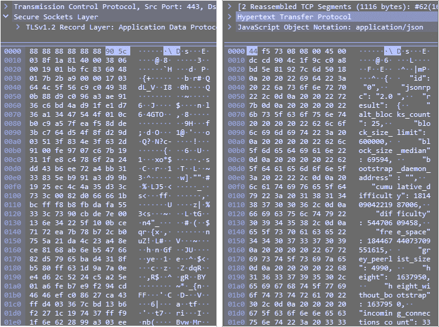

What is DERO
==============================

[DERO](https://github.com/deroproject/derohe) is a general purpose, private, and scalable decentralized application platform that allows developers to deploy powerful and unstoppable applications, while users retain total control over their assets with complete privacy.

The DERO Project has created a platform for developers to deploy secure, open, scalable, and privacy-preserving decentralized applications. DERO is unique because we value security and privacy above all else; as a result, users are able to transact privately over our network without fear of common protocol-level and network attacks. Additionally, our technology preserves transparency where required and scales with network load, which provides an ideal environment for business-class applications.

-   Mining Algorithm:AstroBWT
-   Max supply:21 Million
-   Atomic Units:5
-   Block reward:Halving every 4 years
-   Difficulty:Retargets at every block
-   Ticker:DERO

The DERO Mission
----------------

DERO is a new blockchain technology written in Golang with a focus on enhanced Privacy and Smart Contracts while maintaining the transparency and security of the blockchain. The goal is to create a unique state of the art blockchain technology with enhanced Reliability, Privacy, Security, Usability, and Portability by bringing together some of the best proven technologies. These technologies will include Homomorphic Encryption, Services and Smart Contracts which will allow for the creation and execution of Decentralized Applications on a Secure Private Blockchain.

DERO Foundation
---------------

The DERO Foundation aims to provide support for the advancement of the DERO Platform and supporting the DERO Community to integrate Decentralized Privacy Systems and Standards within the Blockchain Ecosystem. This will help with the creation and deployment of Private Decentralized Applications, Payment Systems, Services and Tools.

### Homomorphic Encryption Blockchain

Account balances and data are never decrypted by the blockchain. Only account owners can decrypt and access their data. Welcome to a new data privacy paradigm.

### Created from Scratch

DERO has been developed from scratch in Golang and is being actively developed by the original developers. It is not a fork of any other coin.

### Secure and Private Smart Contracts

DERO is a homomorphically encrypted protocol that can serve individuals and business worldwide, with fast and anonymous transactions, smart contract and service model.

### Features

-   Homomorphic Encryption Blockchain Protocol
-   Private Smart Contract Platform & Services
-   No Trusted Setups or Hidden Parameters
-   Fast Transaction Confirmations (~18 sec.)
-   Instant Wallet Syncing
-   Fully Scalable Blockchain
-   Turing Complete DVM
-   Decentralized Proof-of-Work Mining

### DHEBP

DERO Homomorphic Encryption Blockchain Protocol (DHEBP) combines homomorphic encryption and an account based model to provide instant transactions as well as security and privacy.

DERO Σ (Sigma) mining and Σ blocks create utilize a network wide consensus for mining as well as rewarding all miners for effort vs a winner take all block reward system. All Transactions are settled in the same block in which they occur, allowing for instant full confirmation.

DERO wallets can only have one open spending transaction at a time to one or many addresses this prevents any sending account from double spending. These transactions are settled on the same block they are sent so subsequent transactions can be made immediately.

### Account based Encrypted Blockchain

True privacy on chain.

While a typical blockchain stores all information on chain in clear text and use a UTXO model, DERO uses a unique encrypted blockchain with an account based model.

Not only does this create a secure and private network, it also gives users the ability to check their balance without syncing the entire chain. Wallets only need to query the most recent block in order to obtain their balance information all while being homomorphically encrypted.

Homomorphic Encryption is a type of encryption that allows operations to be performed on encrypted data without decrypting it first. In essence, operations can be performed without revealing the underlying data.

This account based encrypted blockchain model not only provides superior privacy and security but it also allows for instant transactions, transactions settlement and balance information.

Below is a comparison of DHEBP and a conventional blockchain.

### TLS-SECUREDSecured UDP P2P Network

The DERO Project has built a blockchain network that can be used by millions of users around the globe. This makes the security of the network highly important. Unencrypted network communication posses a risk for privacy, security and data integrity. DERO is the first blockchain project to use self signed TLS encryption for its network communication, which protects the network participants from eavesdropping and tampering of network data.

DERO also utilizes UDP for peer to peer communication instead of TCP. This allows node software to run and listen to network events while reducing exposure to the operating system's kernel and also lowers network overhead.

The DERO team also keeps future large scale applications in mind, e.g. enterprise services which handle thousands of clients per second. They are continuously improving the network in order to accomplish this goal. For example, with the encrypted network, after performing benchmarks they chose ECDSA instead of RSA as method for key generation as it allows for a higher number of handshakes per second.

Comparison below of network data captured from wallet traffic

### The DERO Journey

#### 2017

-   The project was launched in December 2017 comprising a team of three full-time Developers. The core team members each have over a decade of experience in cryptography and multiple years of experience in blockchain development.

#### 2018

-   In April 2018, the DERO network migrated to the Golang code base without a single second of downtime. The migration of the code base coincided with a number of sophisticated attacks on CryptoNote based coins. DERO core team studied how the attacks were implemented and designed a new type of blockchain that is resistant to 51% hashrate attacks and softforks.

-   The DERO project unveiled this new blockchain technology in June 2018, codenamed "Atlantis". It combines the Cryptonote protocol with directed acyclic graph and Bulletproofs. However, these are not just any Bulletproofs, but what have been coined Rocket Bulletproofs, leading to blocktimes of just a few seconds. In a controlled environment, the Atlantis network can achieve blocktimes as low as three seconds processing a thousand transactions per second. A world wide testnet was launched with a nine-second blocktime which allowed for extensive tests of the new technology.

-   July 2018 saw the successful and flawless migration of the DERO network to the new Atlantis codebase with a twelve-second block time and two minute confirmation time. This is by far the fastest CryptoNote based blockchain ever deployed, with 75 transactions per second (Now 750TPS with DHEBP). A relatively longer twelve second block time was chosen so that people in locations with sub-optimal network connectivity could still participate in the network. The Dero team plans to reduce the blocktime further in coming years, as network infrastructure improves around the world.

-   With a ground-breaking new technology established by August 2018, just eight months after conception, the DERO team initiated applications for listings on major exchanges. A bold new marketing initiative is in the process of being established, with a primary focus on professional and business users and developers. An advisory team drawn from and representing the wider DERO community has been formed, and a new DERO Foundation that will support the aims of the DERO Project is in the process of being formed.

#### 2019

-   Stargate Release 1 successfully went to testnet with functioning smart contracts on cryptonote. The developers realized that even though cryptonote was private by nature there was still room for improvement. The devs switched their focus to Fully Homomorphic Encryption which allows operations to be performed on an encrypted data set. This technology has often been referred to as the Holy Grail in cryptocurrency and was not a small task to take on but the project pivoted despite this.

#### 2020

-   AstroBWT is an ASIC/FPGA/GPU resistant CPU mining algorithm that is based on mathematical proofs, unlike many other CPU mining algorithms. AstroBWT is an egalitarian algorith that can run on CPU/GPU/FPGAs and ASICs, however there is little to no economic advantage using specualized hardware. So far, many ARM CPUs prove to have a better hash to watt ratio than even the highest end GPUs. Mining on mobile devices is not only possible but also fairly common.

-   The DERO Homomorphic Encryption Blockchain Protocol (DHEBP) is a new revolutionary protocol for scalable confidential transactions and private smart contracts execution. DHEBP employs an account based structure that removes the requirement for blockchain scanning, which allow wallets to provide instant balances to users.

-   Graviton: ZFS for Key-Value Stores - Graviton is an open source, simple, fast, versioned, authenticated and embeddable key-value store database written in Golang.

-   The DERO team announce the release of a unique homomorphic encryption scheme (DERO-HE) and the complete blockchain protocol (DHEBP) for public testing. DERO will migrate from the existing CryptoNote protocol to its own DERO Homomorphic Encryption Blockchain Protocol (DHEBP).

#### 2021

-   The DERO team announce to bring our long anticipated Stargate RC2 release to the public for testing. Stargate is a general purpose, private, and scalable decentralized application platform that allows developers to deploy powerful and unstoppable applications, while users retain total control over their assets with complete privacy. The technology behind Stargate has evolved over the last few years to challenge many of the issues that are preventing the crypto space from attracting widespread adoption. Preserving user privacy and ensuring a scalable network were the inspiration for this release, since the platform was already developed for speed.

#### 2022

-   Stargate RC2 Released to mainnet.

### DERO Network Specifications

-   18 Second Blocktime
-   Same block/instant confirmation
-   No Soft Forks/Chain Splits
-   SSL/TLS UDP P2P Network
-   A Layer 1 Private Decentralized Application Platform
-   Fully Auditable Supply
-   Fully Encrypted Blockchain
-   No Orphan Blocks
-   Homomorphic Encryption Protocol
-   Native dApp Support
-   Written from Scratch in Golang
-   1.25 MB Block Size

### DERO Mining

Mining DERO has been completely reworked to vastly decentralize mining rewards with the introduction of Σ-blocks (Sigma blocks), which are simply smaller blocks that are constantly emitted every 1 second and converge into the final 18 second block. Even more plainly, the Σ-Blocks allow on-chain storage of mining data, which effectively turns DERO into one large mining pool. Every miner on the entire network will receive mining rewards based on the amount of work that was contributed, thus creating a truly decentralized network and distribution of rewards. It also greatly improves handling of massive network traffic, where each daemon can support over 10,000 connected devices, acting as a way to pool all of your devices.

The current configuration of Σ Mining is that all Σ-blocks settle every main block (~18 seconds) and settles all mining rewards every 18 blocks. There are ~86,400 reward blocks daily

If a miner has 1/86400 (total daily emitted Σ-Blocks) of the total network hashrate, the miner will get probabilistically averaged rewards daily based on shares contributed. For example, 100K miners will get rewards daily. Similarly, if a miner has mining power amounting to half of 1/86400 (or 1/172800), the miner will get rewards every 2 days.

For a list of hardware benchmakrs please visit our community created benchmark website [here](https://benchmark.dero.network/)

In addition, each daemon essentially functions as it's own mining pool, which tracks mining shares from devices connected to it. The daemon itself will retain a fixed fee of 1.6% for the daemon operator, the rest will be distributed to all miners that contributed shares to that daemon. For most miners, they will be mining using their own daemon, so all rewards and fees will be credited.

We encourage everyone to mine and run their own node!

### DERO Milestones

-   December 2017 - Launch of DERO Project
-   March 2018 - Implementation of the CryptoNote Protocol in Golang completed
-   April 2018 - DERO mainnet migrates to the Golang implementation
-   June 2018 - DERO Atlantis development completed and testnet launched
-   July 2018 - Mainnet migrates to Atlantis code base with 12 secs block time and Rocket Bulletproofs
-   October 2018 - Completely in browser web wallet completed with client side key storage
-   January 2019 - DERO Stargate RC1 testnet released, providing fully functional smart contracts on cryptonote.
-   March 2020 - DERO releases and migrates to AstroBWT an egalitarian PoW algorithm that makes CPU mining economically effcient.
-   August 2020 - DHEBP - DERO Homomorphic Encryption Blockchain Protocol
-   Sept 2020 - Graviton: ZFS for Key-Value Stores
-   February 2021 - Stargate RC2 using DHEBP on Testnet
-   February 2022 - Stargate RC2 with Private Smart Contracts and Services launched on mainnet.
-   Future Development - DERO developers continue research and development, including quantum resistance

### Downloads

We have builds for Windows, Linux and Mac

-   [Windows](https://dero.io/download.html#windows)
-   [Linux](https://dero.io/download.html#linux)
-   [Mac](https://dero.io/download.html#macos)
-   [Github](https://github.com/deroproject/derohe/)

#### Wallets

Below are download links for all platforms and also links to source code if you wish to compile on your own. There are two types of wallets available for download including the official CLI wallet (command line) and the DERO Foundation's GUI wallet (named NODE). The browser wallet is also available as a cross platform solution but may not always work with your setup.

There are no official mobile wallets at this time.

Use 3rd party mobile wallets at your own risk.

Always use official DERO or DERO Foundation approved wallets

-   Windows
    -   [Command Line Interface (CLI) Wallet](https://github.com/deroproject/derohe/releases/latest/download/dero_windows_amd64.zip)
    -   [Engram (GUI) Wallet](https://github.com/DEROFDN/Engram/releases/download/0.1.2/engram-windows-amd64.zip)
-   Linux
    -   [Command Line Interface (CLI) Wallet - CLI Wallet - 64-bit](https://github.com/deroproject/derohe/releases/latest/download/dero_linux_amd64.tar.gz)
    -   [Command Line Interface (CLI) Wallet - CLI Wallet - ARM 7](https://github.com/deroproject/derohe/releases/latest/download/dero_linux_arm7.tar.gz)
    -   [Command Line Interface (CLI) Wallet - CLI Wallet - ARM 64](https://github.com/deroproject/derohe/releases/latest/download/dero_linux_arm64.tar.gz)
    -   [Engram (GUI) Wallet](https://github.com/DEROFDN/Engram/releases/download/0.1.2/engram-linux-amd64.tar.xz)
-   MacOS
    -   [Command Line Interface (CLI) Wallet](https://github.com/deroproject/derohe/releases/latest/download/dero_darwin_universal.tar.gz)
    -   [Engram (GUI) Wallet](https://github.com/DEROFDN/Engram/releases/download/0.1.2/engram-macos-amd64.zip)
-   FreeBSD
    -   [Command Line Interface (CLI) Wallet](https://github.com/deroproject/derohe/releases/latest/download/dero_freebsd_amd64.tar.gz)

#### Source Code

If you wish to compile DERO yourself, checkout github and our git.dero.io.

-   [Zip File](https://github.com/deroproject/derohe/archive/refs/heads/main.zip)
-   [TAR File](https://github.com/deroproject/derohe/archive/refs/heads/main.tar.gz)

### Connect with DERO

Reach out to us on any of the following platforms

-   [Discord](https://discord.gg/H95TJDp)
-   [Matrix](https://matrix.to/#/#general:matrix.dero.live)
-   [Twitter](https://twitter.com/deroproject)
-   [Reddit](https://www.reddit.com/r/DeroProject/)
-   [DERO Forum](https://forum.dero.io/)
-   [Mailing List](https://lists.dero.io/)
-   [Medium](https://medium.com/deroproject)